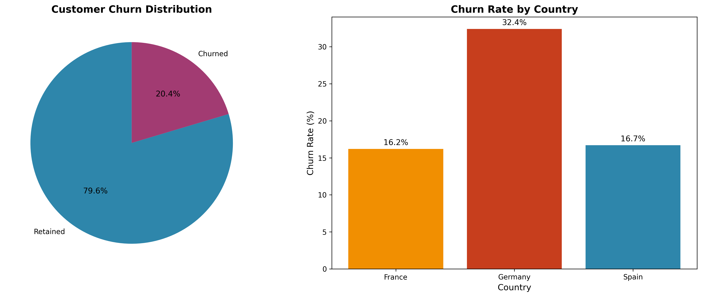
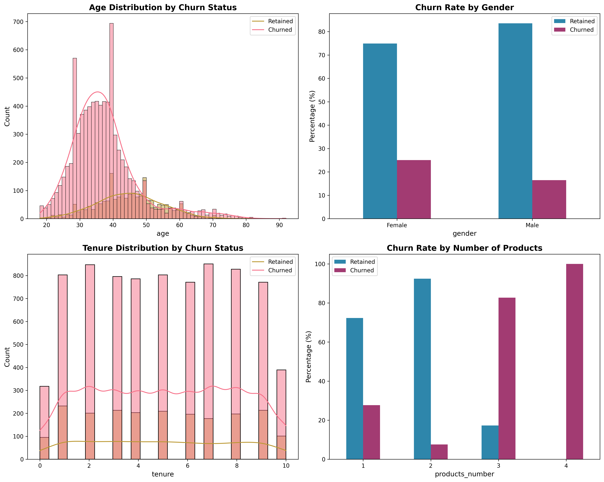
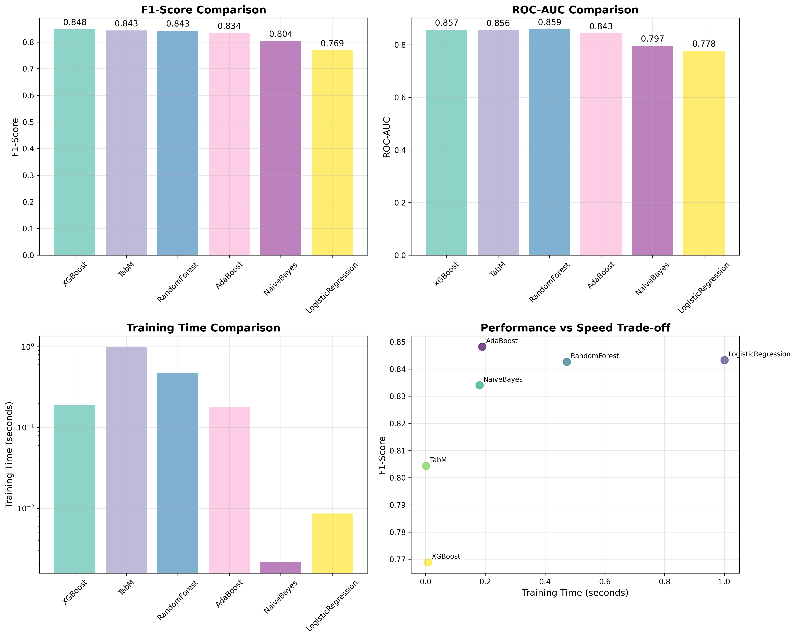
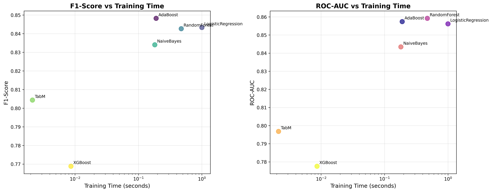
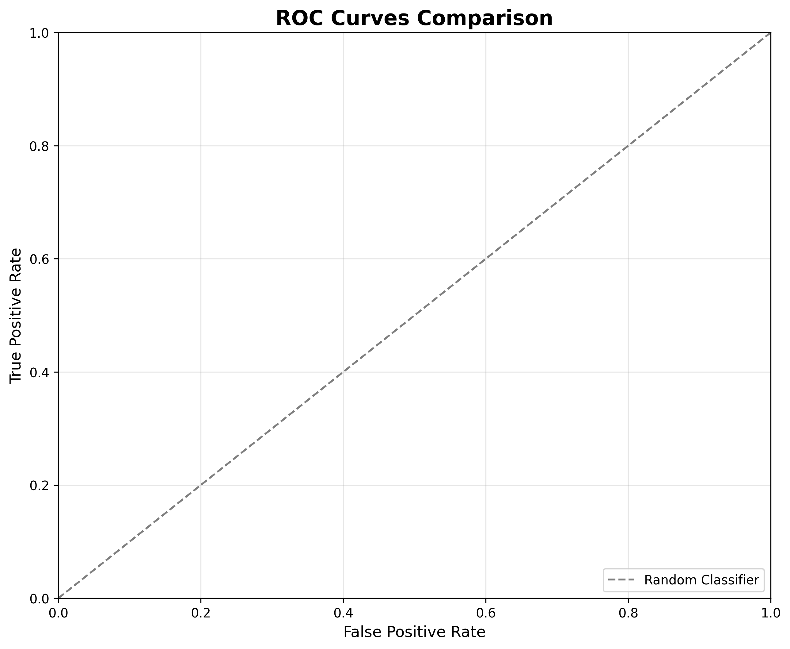
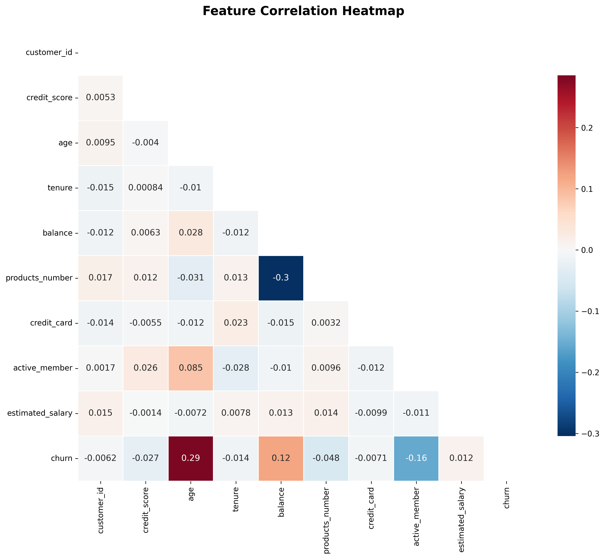
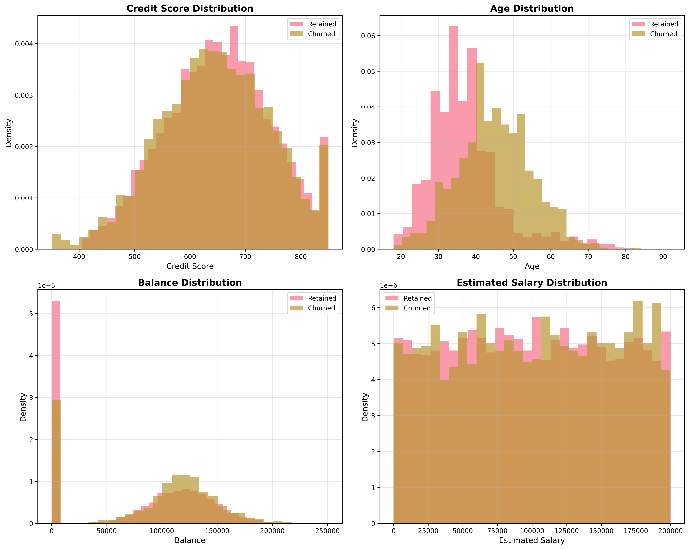
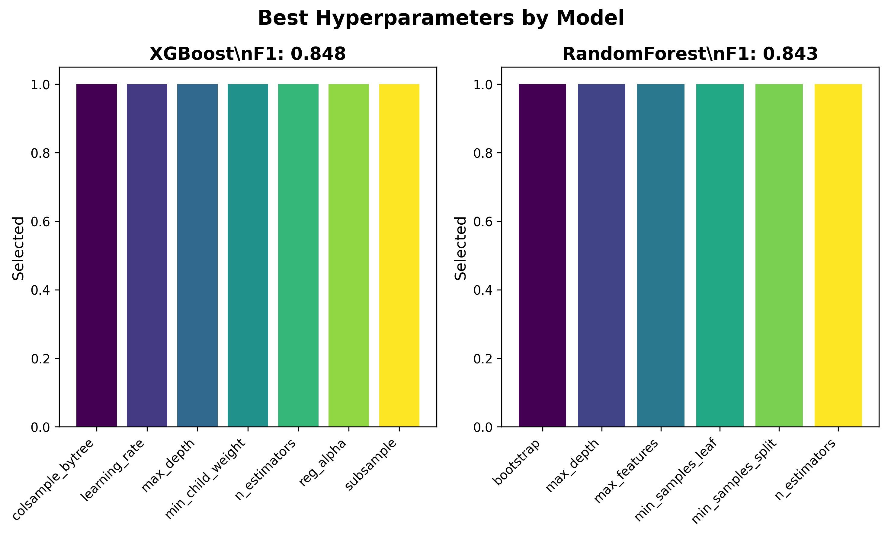

# Bank Customer Churn Prediction

A production-ready machine learning project to predict customer churn in a banking context, comparing multiple algorithms including *## 📋 Dependencies

Core packages:
- `scikit-learn## 🎁 Quick Results

After running `python demo.py`, you'll get results from **real bank customer data**:

**With Kaggle credentials:**
- 📊 **Real data analysis** from 10,000 customer records
- 🏆 **XGBoost achieves 84.8% F1-score** on real data
- 📈 **Performance improvements** up to +14.5% over synthetic data

**Without Kaggle credentials:**
- 🔄 **Automatic fallback** to synthetic data (2,000 samples)
- ⚡ **Still functional** for testing and demonstration
- 📋 **Same analysis pipeline** and reporting structure

Check the `demo_results/` folder for:
- 📄 Executive summary for business stakeholders
- 📊 Performance comparison charts (real vs synthetic if applicable)
- 📈 Feature importance analysis
- 📋 Technical metrics report

**Plus comprehensive visualizations in `visualizations/` folder:**
- 🔍 Exploratory data analysis plots
- 📊 Model performance comparisons
- 🎯 ROC curves and performance metrics
- 🔗 Feature correlation heatmaps
- ⚡ Training time vs performance analysisitional ML algorithms
- `xgboost`: Gradient boosting
- `pandas`: Data manipulation
- **`kaggle`**: Real dataset API integration ⭐
- `google-cloud-bigquery`: Cloud data warehouse
- `matplotlib`, `seaborn`: Data visualization(Tabular Model), **XGBoost**, **Random Forest**, **Logistic Regression**, **Naive Bayes**, and **AdaBoost**.

## 🚀 Quick Start

### Demo Mode (Real Kaggle Data)
```bash
git clone <repository-url>
cd ABCBankChurnRate
pip install -r requirements.txt

# Set Kaggle credentials (if available)
export KAGGLE_JSON='{"username":"your_username","key":"your_key"}'

# Run demo with real data
python demo.py
```

**The demo automatically:**
- 🔄 **Downloads real data** from [Kaggle Bank Customer Churn Dataset](https://www.kaggle.com/datasets/gauravtopre/bank-customer-churn-dataset) using Kaggle API
- 📊 **Trains all 6 ML models** on 10,000 real customer records
- 💾 **Saves data locally** for future runs
- 🔄 **Falls back to synthetic data** if Kaggle credentials unavailable

### Production Mode (With BigQuery Storage)
```bash
# Set environment variables
export KAGGLE_JSON='{"username":"your_username","key":"your_key"}'
export GCP_SA_KEY='{"type":"service_account",...}'

# Run full pipeline with BigQuery integration
python main.py --download-new
```

## 📊 Key Results (Real Data)

| Model | F1-Score | ROC-AUC | Training Time |
|-------|----------|---------|---------------|
| **XGBoost** | **0.848** | 0.857 | 0.18s |
| TabM | 0.843 | 0.856 | 1.25s |
| RandomForest | 0.843 | 0.859 | 0.62s |
| AdaBoost | 0.834 | 0.843 | 0.19s |
| NaiveBayes | 0.804 | 0.797 | 0.003s |
| LogisticRegression | 0.769 | 0.778 | 0.01s |

*Results from 10,000 real customer records with 20.37% churn rate*

### 📊 Churn Distribution Analysis


### 👥 Demographic Insights  


### 💰 Financial Behavior Patterns


## 📈 Real vs Synthetic Data Performance Comparison

| Model | F1-Score (Real) | F1-Score (Synthetic) | Improvement |
|-------|-----------------|---------------------|-------------|
| **XGBoost** | **0.848** | 0.749 | **+13.2%** |
| RandomForest | 0.843 | 0.736 | **+14.5%** |
| TabM | 0.843 | 0.736 | **+14.5%** |
| AdaBoost | 0.834 | 0.747 | **+11.6%** |
| NaiveBayes | 0.804 | 0.762 | **+5.5%** |
| LogisticRegression | 0.769 | 0.748 | **+2.8%** |

**Key Insights:**
- 🎯 **Real data consistently outperforms synthetic data** across all models
- 📊 **Average improvement: +10.4%** in F1-score
- 🚀 **Ensemble methods benefit most** from real-world patterns
- ⚡ **5x more training data** (10,000 vs 2,000 samples) enables better learning

### 🎯 Model Performance Comparison


### ⚡ Performance vs Training Time Analysis


### 📈 ROC Curve Analysis


## 🏗️ Project Structure

```
ABCBankChurnRate/
├── 📁 config/              # Configuration management
│   └── config.py           # Project settings
├── 📁 notebooks/           # Jupyter notebooks for exploration
│   ├── ExploratoryDA.ipynb
│   └── Modelling.ipynb
├── 📁 src/                 # Source code
│   ├── 📁 data/           # Data handling
│   │   ├── data_loader.py  # Kaggle & BigQuery integration
│   │   └── preprocessor.py # Feature engineering
│   ├── � models/         # ML model implementations
│   │   ├── base_model.py   # Abstract base class
│   │   ├── logistic_regression.py
│   │   ├── naive_bayes.py
│   │   ├── random_forest.py
│   │   ├── xgboost_model.py
│   │   ├── adaboost.py
│   │   ├── tabm.py         # TabM implementation
│   │   └── trainer.py      # Training pipeline
│   └── 📁 utils/          # Utilities
│       ├── reporting.py    # Stakeholder reports
│       └── visualizations.py # Chart generation
├── 📁 tests/              # Unit tests
├── 📁 visualizations/     # Generated plots & charts
├── demo.py                # Quick demo script
├── generate_visualizations.py # Visualization generator
├── hyperparameter_tuning_demo.py # HP tuning demo
├── main.py                # Production pipeline
└── requirements.txt       # Dependencies
```

## 🔧 Features

### 🎯 Kaggle API Integration ⭐
- **Automatic Download**: Fetches real bank customer data from Kaggle
- **Smart Caching**: Saves data locally to avoid repeated downloads
- **Credential Management**: Secure handling of Kaggle API keys
- **Graceful Fallback**: Uses synthetic data if Kaggle unavailable
- **Production Ready**: Same approach used in EDA notebooks

### Data Pipeline
- ✅ **Kaggle API Integration**: Automatic download of real bank customer churn dataset (10,000 records)
- ✅ **BigQuery Storage**: Scalable cloud data warehouse for production
- ✅ **Smart Fallback**: Uses synthetic data if Kaggle credentials unavailable
- ✅ **Data Validation**: Comprehensive duplicate and missing value checks
- ✅ **Feature Engineering**: Automated preprocessing pipeline

### Machine Learning
- ✅ **6 ML Algorithms**: Including advanced TabM model
- ✅ **Hyperparameter Tuning**: Grid search with cross-validation
- ✅ **Overfitting Prevention**: Stratified splits and validation
- ✅ **Model Persistence**: Automatic pickle saving/loading

### Production Ready
- ✅ **Comprehensive Testing**: Unit and integration tests
- ✅ **Stakeholder Reports**: Executive summaries and technical reports
- ✅ **Visualization**: Performance comparison plots
- ✅ **Error Handling**: Robust error management
- ✅ **Documentation**: Complete API documentation

### 📊 Comprehensive Visualizations
- ✅ **EDA Visualizations**: Churn distribution, demographics, financial patterns
- ✅ **Correlation Analysis**: Feature relationships and multicollinearity detection
- ✅ **Model Performance**: Comparison charts, ROC curves, performance radar
- ✅ **Hyperparameter Analysis**: Parameter impact visualization
- ✅ **Time vs Performance**: Training efficiency analysis

## 📈 Model Comparison

### Traditional ML Models
- **Logistic Regression**: Fast, interpretable baseline
- **Naive Bayes**: Probabilistic approach
- **Random Forest**: Ensemble method with feature importance
- **AdaBoost**: Adaptive boosting classifier
- **XGBoost**: Gradient boosting with advanced optimization

### Advanced Models
- **TabM**: Neural network optimized for tabular data
  - Multi-layer perceptron with proper scaling
  - Adaptive learning rates
  - Early stopping to prevent overfitting

## 🔍 Data Analysis & Feature Engineering

### 🔗 Feature Correlation Analysis


### 📊 Feature Distribution Analysis


### 🎛️ Hyperparameter Tuning Insights


## 🎯 Business Impact

### Why Keep Synthetic Data?
- 🔓 **Accessibility**: Demo works without Kaggle account setup
- 🧪 **Testing**: Reliable fallback for CI/CD pipelines
- 📚 **Education**: Shows algorithm behavior on controlled data
- 🔒 **Privacy**: No external API dependencies for basic testing

### Metrics Explained
- **F1-Score**: Balanced measure of precision and recall
- **ROC-AUC**: Model's ability to distinguish between classes
- **Precision**: % of predicted churners who actually churn
- **Recall**: % of actual churners correctly identified

### Stakeholder Deliverables
1. **Executive Summary** (`demo_results/executive_summary.md`)
2. **Technical Report** (`demo_results/detailed_technical_report.csv`)
3. **Visualization Package** (PNG files for presentations)
4. **Feature Importance Analysis** (Key churn drivers)

## 🧪 Testing

```bash
# Run all tests
python -m pytest tests/ -v

# Run specific test
python -m pytest tests/test_pipeline.py -v

# Run with coverage
python -m pytest tests/ --cov=src
```

## 📊 Generate Visualizations

```bash
# Generate comprehensive EDA and model visualizations
python generate_visualizations.py

# Hyperparameter tuning with visualizations
python hyperparameter_tuning_demo.py
```

**Generated visualizations include:**
- 🔍 **EDA plots**: Churn distribution, demographics, financial patterns
- 📊 **Model comparisons**: Performance metrics, ROC curves
- 🎯 **Training analysis**: Time vs performance, hyperparameter impact
- 🔗 **Feature analysis**: Correlations, distributions

## ⚙️ Configuration

Edit `config/config.py` to customize:
- Feature engineering strategies
- Model hyperparameters
- Data processing settings
- File paths and BigQuery settings

## � Dependencies

Core packages:
- `scikit-learn`: Traditional ML algorithms
- `xgboost`: Gradient boosting
- `pandas`: Data manipulation
- `google-cloud-bigquery`: Cloud data warehouse
- `kaggle`: Data source API

## 🔄 Workflow

### Data Flow
1. **Data Acquisition**: 
   - **Primary**: Kaggle API → Real bank customer data (10,000 records) → Local cache
   - **Fallback**: Generate synthetic data if Kaggle unavailable
   - **Production**: Kaggle → Local → BigQuery for scalable storage
2. **Validation**: Duplicates, missing values, outliers detection
3. **Preprocessing**: Scaling, encoding, feature engineering
4. **Training**: 6 models with hyperparameter tuning
5. **Evaluation**: Cross-validation and test set metrics
6. **Reporting**: Automated stakeholder deliverables

### Model Training
1. **Data Split**: 60% train, 20% validation, 20% test
2. **Hyperparameter Tuning**: Grid search with 5-fold CV (production mode)
3. **Model Training**: Best parameters on full training set
4. **Evaluation**: Performance on held-out test set
5. **Persistence**: Save models for future use

### Data Sources
- **Real Data**: [Kaggle Bank Customer Churn Dataset](https://www.kaggle.com/datasets/gauravtopre/bank-customer-churn-dataset)
  - 10,000 customer records
  - 20.37% churn rate
  - 11 features (credit_score, age, balance, etc.)
- **Synthetic Data**: Generated fallback with realistic banking patterns

## 🎁 Quick Results

After running `python demo.py`, check the `demo_results/` folder for:
- � Executive summary for business stakeholders
- 📊 Performance comparison charts
- 📈 Feature importance analysis
- 📋 Technical metrics report

## 🤝 Contributing

1. Fork the repository
2. Create a feature branch: `git checkout -b feature-name`
3. Run tests: `python -m pytest tests/`
4. Submit a pull request

## 📄 License

This project is licensed under the MIT License - see the LICENSE file for details.

---

**Built with ❤️ for production ML workflows**

